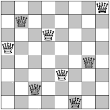

# Resolução do Problema das 8 rainhas utilizando o algoritmo de Holland

## Problema das 8 rainhas

O problema das 8 rainhas é um problema de lógica e matemática que consiste em colocar 8 rainhas em um tabuleiro de xadrez de 8x8 de forma que nenhuma delas sejam atacadas pelas demais. O objetivo é encontrar todas as soluções possíveis para esse problema. É considerado um problema clássico de inteligência artificial e programação.

## Algoritmo de Holland

O Algoritmo de Holland é um algoritmo genético, que é um tipo de algoritmo de otimização inspirado no processo evolutivo da natureza. Ele foi desenvolvido por John Holland na década de 1970 e é usado para resolver problemas complexos de otimização. O algoritmo funciona criando uma população inicial de soluções possíveis para o problema e, em seguida, usando operações de seleção, recombinação e mutação para evoluir a população ao longo de várias gerações, com o objetivo de encontrar a solução ótima. É amplamente utilizado em muitos campos, incluindo engenharia, ciência da computação e finanças.

## Solução

* [Link para o notebook no colab](https://colab.research.google.com/drive/1eAwy11GUStwoN5p-7MjWSNl22YzJkfm3?usp=sharing)
* [Notebook do repositório](./problema_oito_rainhas.ipynb)
* [Apenas código .py](./problema_oito_rainhas.py)

_Aluna: Eirene de Oliveira Fireman_ 
